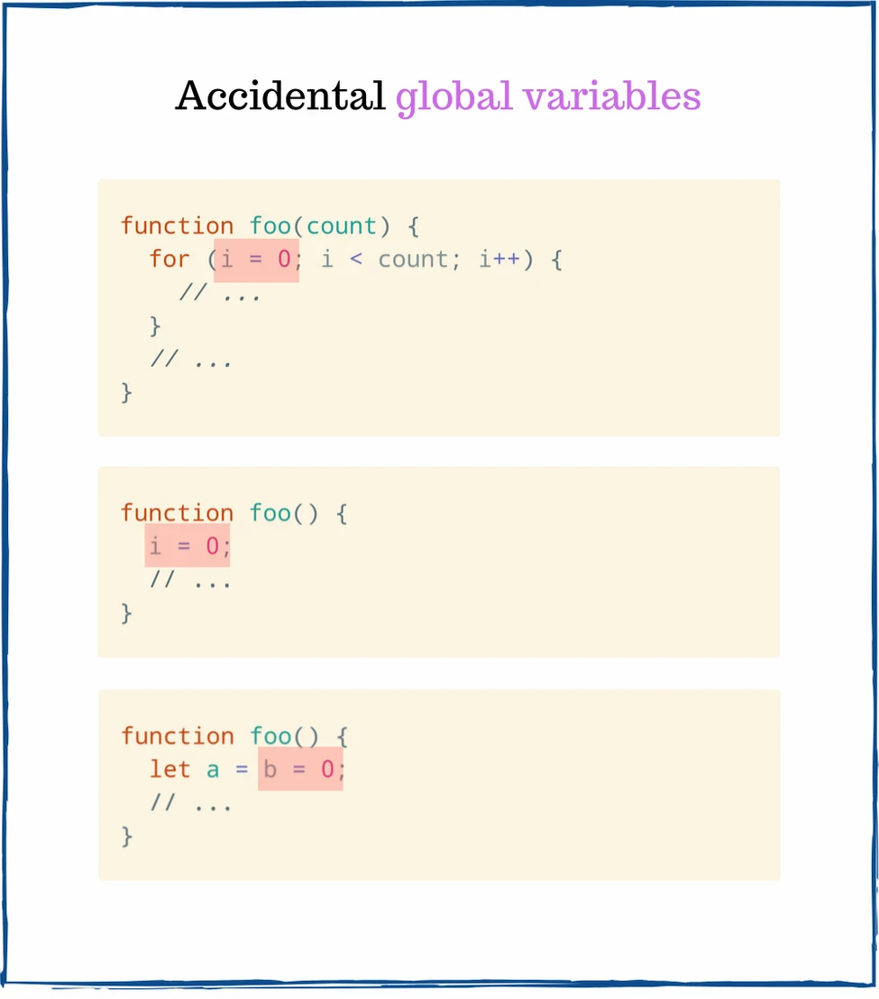
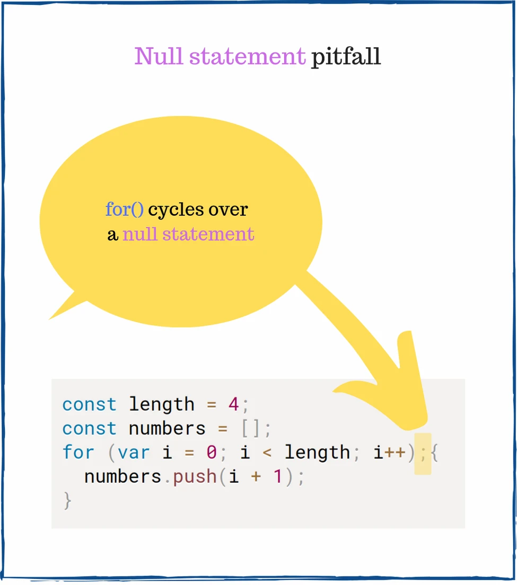
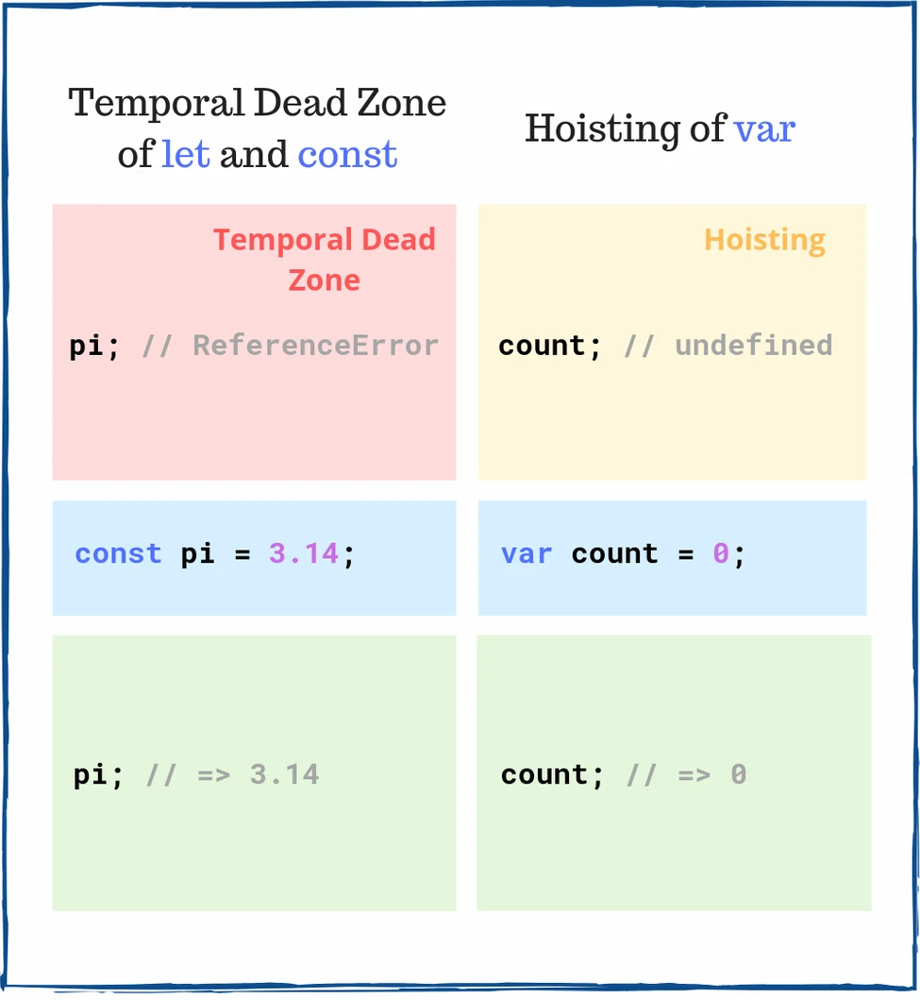

## 7个简单却棘手的JavaScript面试问题

[7 Simple but Tricky JavaScript Interview Questions](https://dmitripavlutin.com/simple-but-tricky-javascript-interview-questions/)

在软件开发中，最让我累觉不爱的事情是：

1. 代码面试
2. 坑爹的产品经历和猪队友

不是JavaScript、`this`、CSS、IE，而是上面这两种。

如果你是一位擅长JavaScript的高级工程师，那么很有可能在代码面试中被问到一些棘手的问题。

这不公平，一些不知天高地厚的人试图掂掂你有几斤几两。这可不是什么令人愉悦的体验。

对此你能做什么呢？

要记住：熟能生巧。深入、反复地学习JavaScript会提升你的编程和面试技巧。

在这篇博客中，你将学习7个看起来简单，但实际上棘手的JavaScript面试问题。

尽管问题看起来是随机的，但是这些问题涉及JavaScript的重要概念。因此最好在下一次面试之前练习它们！

#### 问题一：随机全局变量
```javascript
function foo() {
  let a = b = 0;
  a++;
  return a;
}

foo();
typeof a; // => ???
typeof b; // => ???
```
我们来看一下第2行代码：`let a = b = 0`。这段语句声明了一个局部变量`a`，与此同时，它也声明了一个全局变量`b`。

因为在函数`foo()`作用域和全局作用域中都没有声明变量`b`，所以JavaScript把`b = 0`表达式当成`window.b = 0`。

换句话说，`b`是偶然间创建的全局变量。



在浏览器中，之前的代码等价于：
```javascript
function foo() {
  let a;
  window.b = 0;
  a = window.b;
  a++;
  return a;
}

foo();
typeof a;        // => 'undefined' 
typeof window.b; // => 'number'
```
`typeof a`是`undefined`，因为变量`a`在函数`foo()`的作用域中，外部作用域无法获取`a`。

因为`b`是值为`0`的全局变量，所以`typeof b`显示为`number`。

#### 问题二：数组长度属性
```javascript
const clothes = ['jacket', 't-shirt'];
clothes.length = 0;

clothes[0]; // => ???
```
数组对象的`length`属性有一个特殊的行为：
> 减少`length`属性的值将会导致数组索引在新旧`length`值之间的数组元素被删除。

因此当JavaScript执行`clothes.length = 0`操作时，`clothes`所有项被删除。

因为`clothes`数组被清空了，所以`clothes[0]`为`undefined`。

#### 问题三：鹰眼测试（Eagle eye test）
```javascript
const length = 4;
const numbers = [];
for (var i = 0; i < length; i++); {
  numbers.push(i + 1);
}

numbers; // => ???
```
我们仔细看一下出现在左大括号`{`左侧的分号`;`:



容易被忽略的分号创建了一个空语句（null statement），空语句不执行任何操作。

`for()`在空语句上（不执行任何操作）迭代4次，忽略后面的`{ numbers.push(i + 1); }`。

上面的代码等价于：
```javascript
const length = 4;
const numbers = [];
var i;
for (i = 0; i < length; i++) {
  // 不执行任何操作
}
{
  numbers.push(i + 1);
}

numbers; // => [5]
```
`for()`将变量`i`递增到`4`，然后执行`{ numbers.push(i + 1); }`，将`4 + 1`推到`numbers`数组。

`numbers`数组为`[5]`。

#### 问题四：自动插入分号
```javascript
function arrayFromValue(item) {
  return 
    [item];
}

arrayFromValue(10); // => ???
```
这里很容易忽视`return`关键字和`[item]`表达式之间的换行符。

但是，这个换行符让JavaScript在`return`和`[item]`之间自动插入了一个分号。

因此上面的代码等价于在`return`之后插入了分号：
```javascript
function arrayFromValue(item) {
  return;
  [item];
}

arrayFromValue(10); // => undefined
```
函数中的`return;`返回`undefined`，因此`arrayFromValue(10)`为`undefined`。

想要了解更多有关分号自动插入内容请阅读[此章节](https://dmitripavlutin.com/7-tips-to-handle-undefined-in-javascript/#24-function-return-value)。

#### 问题五：经典问题——闭包
```javascript
let i;
for (i = 0; i < 3; i++) {
  const log = () => {
    console.log(i);
  }
  setTimeout(log, 100);
}
```
以上代码会从控制台输出什么？

如果你之前还没听说过这个问题，很有可能你的答案是`1`、`2`和`3`，这是不对的。我第一次做这道题，我的答案也是`1`、`2`、`3`！

执行这段代码背后有两个阶段。

**阶段1**

1. `for()`迭代3次，每次迭代都会创建一个新的函数`log()`来捕获变量`i`。然后`setTimeout()`计划执行`log()`。
2. 当`for()`循环结束时，变量`i`的值为`3`。

`log()`是一个闭包，它捕获定义在外部作用域`for()`循环中的变量`i`。理解闭包词法上捕获变量`i`这一点至关重要。

**阶段2**

阶段2发生在100毫秒之后：

1. `setTimeout()`调用3个计划好的`log()`回调。`log`读取当前变量`i`的值，当前变量`i`的值为3，控制台输出`3`。

这就是为什么控制台输出的是`3`、`3`、`3`。

如果你觉得闭包理解起来很困难，我建议阅读[JavaScript闭包的简明阐释](https://dmitripavlutin.com/simple-explanation-of-javascript-closures/)。

你知道如何修改上面的代码输出`0`、`1`、`2`吗？在下方的评论里写下你的答案吧！

#### 问题六：浮点数
```javascript
0.1 + 0.2 === 0.3 // => ???
```
首先我们来看一下`0.1 + 0.2`的值：
```javascript
0.1 + 0.2; // => 0.30000000000000004
```
`0.1`和`0.2`的和并不是恰好是0.3，而是比`0.3`大一点。

由于浮点数以二进制的方式进行编码，因此浮点数相加之类的操作会产生舍入误差。

简而言之，直接比较浮点数并不精确。

因此`0.1 + 0.2 === 0.3`是`false`。

想要了解更多信息请查阅[0.30000000000000004.com](https://0.30000000000000004.com/)。


#### 问题七：变量提升
```javascript
myVar; // => ???
myConst; // => ???

var myVar = 'value';
const myConst = 3.14;
```
变量提升和暂时性死区是影响JavaScript变量生命周期的2个重要概念。


在声明之前访问`myVar`结果是`undefined`，被提升的变量`var`在初始化之前值为`undefined`。

然而，在声明行之前访问`myConst`会抛出`ReferenceError`。变量`const`在声明行`const myConst = 3.14`之前处在一个暂时性死区。

想要掌握好变量提升的概念，请参阅指南[JavaScript变量提升详解](https://dmitripavlutin.com/javascript-hoisting-in-details/)。

#### 划重点
你可能认为一些问题对面试毫无用处，我也有同感，特别是问题三的鹰眼测试。尽管如此，这些问题还是可能被问到。

无论怎么说，这些问题中许多都可以测试你是否真的精通JavaScript，比如说闭包的问题。如果你在看这篇博客的时候有不明白的地方，这对你接下来要学什么将很有启发！

那么在面试中提这种棘手的问题是否公平呢？请发表你的观点。
