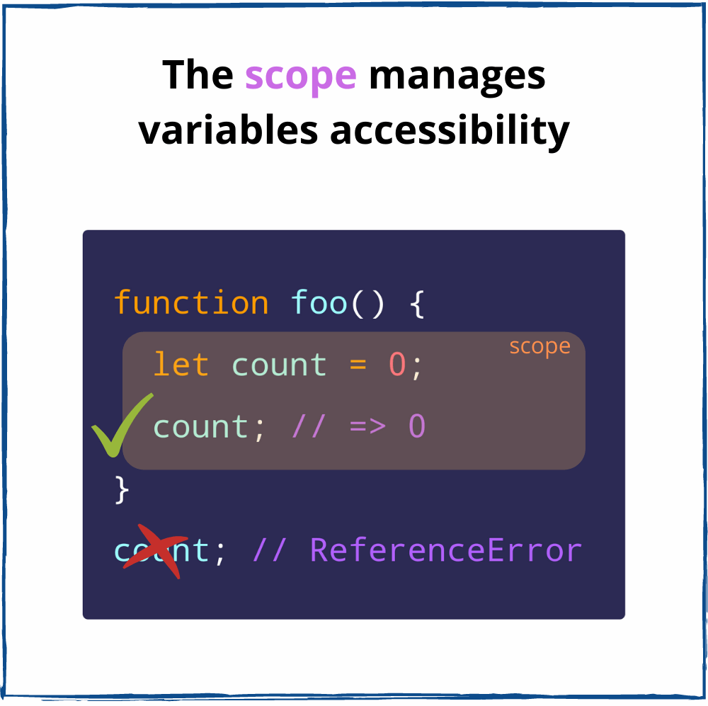

## JavaScript闭包的简明阐释
[A Simple Explanation of JavaScript Closures](https://dmitripavlutin.com/simple-explanation-of-javascript-closures/)

借助闭包，回调函数、事件处理器和高阶函数才能够访问外部作用域的变量。闭包在函数式编程中是重要的，并且在关于JavaScript的面试中也经常被问到。

尽管闭包无处不在，但是想要掌握它非常困难。如果你在学习闭包中没有恍然大悟的那一刻，那么这篇文章就是为你准备的。

我会从基本的术语入手：作用域和词法作用域。在弄懂这些基础后，你举例最后理解闭包就只有一步之遥了。

在开始之前，我建议你不要跳过作用域和词法作用域部分，这些部分对理解闭包至关重要，如果你弄懂了这些部分内容，闭包的概念将不证自明。

### 一 作用域
我们在定义一个变量的时候，希望可以在某些范围内访问它。例如，在`calculate()`函数中`result`变量存在是有意义的，但是在`calculate`函数外，`result`变量是没用的。

变量的可访问性取决于作用域。在变量的作用域中你可以自由访问它，但在作用域之外，该变量不可访问。

在JavaScript中，作用域由函数或代码块创建。

让我们来看一下作用域是如何影响变量`count`的可用性。变量`count`属于函数`foo()`创建的作用域。

```javascript
function foo() {
  // 函数作用域
  let count = 0;
  console.log(count); // logs 0
}

foo();
console.log(count); // ReferenceError: count is not defined
```

在`foo()`作用域中可以自由访问`count`。

然而，在`foo()`作用域之外，`count`是不可访问的。如果你试图从外部访问`count`，JavaScript会抛出`ReferenceError: count is not defined`。

在JavaScript中，作用域表示如果你在函数或代码块内定义变量，那么你只可以在函数或代码块内使用该变量。上面的例子证明了这个行为。



现在我们来看关于作用域的概况表述：
> 作用域是一个控制变量可访问性的空间上的策略。
直接导致的属性就是作用域会隔离变量，这样很好因为不同的作用域可以拥有相同的变量名。

你可以在不同的作用域里重用常见的变量名（`count`、`index`、`current`、`value`等），而不必担心发生冲突。

`foo()`和`bar()`函数拥有它们各自的同名变量`count`：
```javascript
function foo() {
  // "foo" function scope
  let count = 0;
  console.log(count); // logs 0
}

function bar() {
  // "bar" function scope
  let count = 1;
  console.log(count); // logs 1
}

foo();
bar();
```
`foo()`和`bar()`函数作用域中的变量`count`不会发生冲突。

### 二 作用域嵌套
