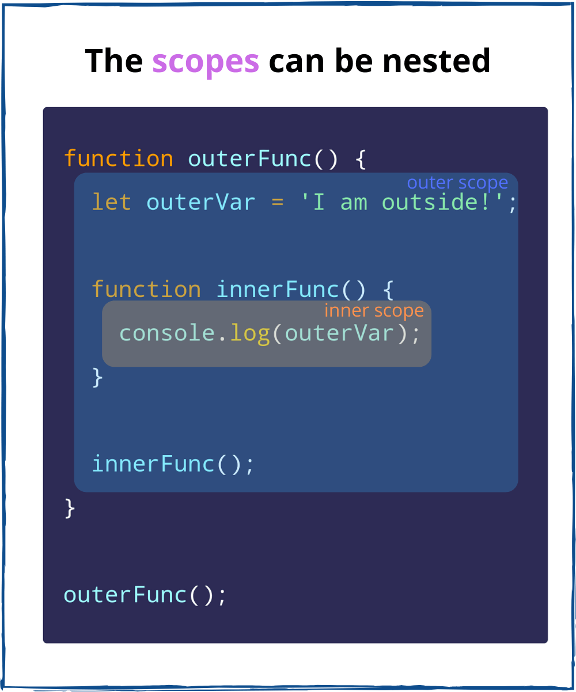
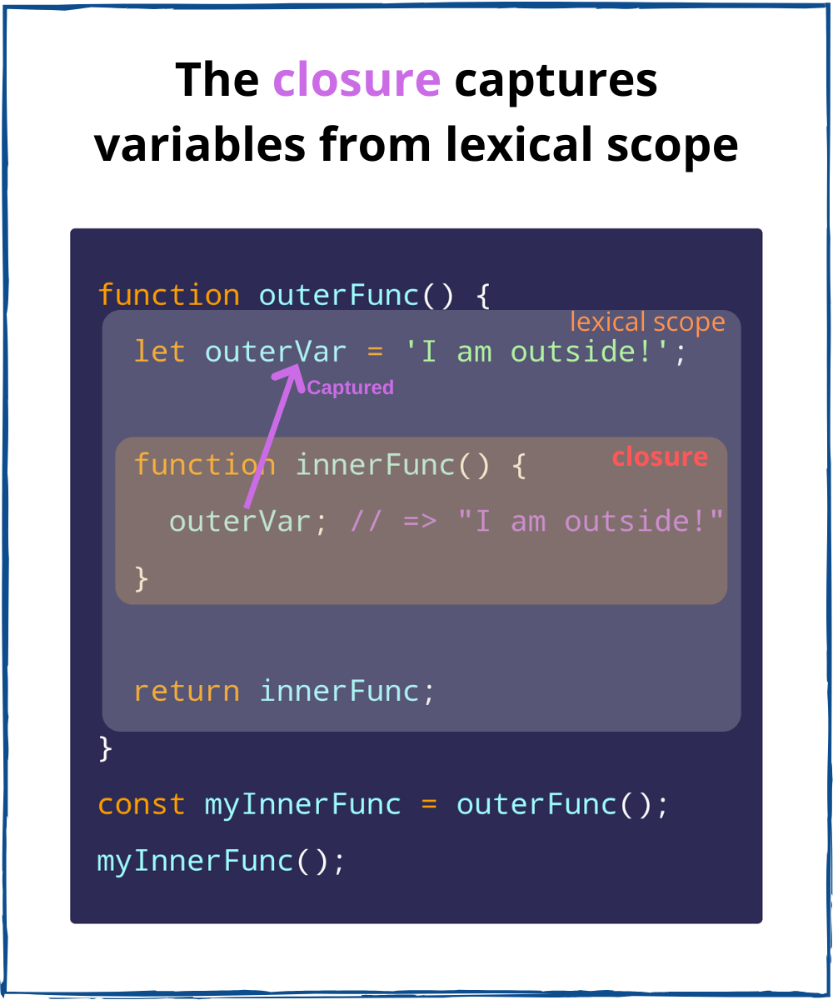

## JavaScript闭包的简明阐释
[A Simple Explanation of JavaScript Closures](https://dmitripavlutin.com/simple-explanation-of-javascript-closures/)

借助闭包，回调函数、事件处理器和高阶函数才能够访问外部作用域的变量。闭包在函数式编程中是重要的，并且在关于JavaScript的面试中也经常被问到。

尽管闭包无处不在，但是想要掌握它非常困难。如果你在学习闭包中没有恍然大悟的那一刻，那么这篇文章就是为你准备的。

我会从基本的术语入手：作用域和词法作用域。在弄懂这些基础后，你举例最后理解闭包就只有一步之遥了。

在开始之前，我建议你不要跳过作用域和词法作用域部分，这些部分对理解闭包至关重要，如果你弄懂了这些部分内容，闭包的概念将不证自明。

### 一 作用域
我们在定义一个变量的时候，希望可以在某些范围内访问它。例如，在`calculate()`函数中`result`变量存在是有意义的，但是在`calculate`函数外，`result`变量是没用的。

变量的可访问性取决于作用域。在变量的作用域中你可以自由访问它，但在作用域之外，该变量不可访问。

在JavaScript中，作用域由函数或代码块创建。

让我们来看一下作用域是如何影响变量`count`的可用性。变量`count`属于函数`foo()`创建的作用域。

```javascript
function foo() {
  // 函数作用域
  let count = 0;
  console.log(count); // 0
}

foo();
console.log(count); // ReferenceError: count is not defined
```

在`foo()`作用域中可以自由访问`count`。

然而，在`foo()`作用域之外，`count`是不可访问的。如果你试图从外部访问`count`，JavaScript会抛出`ReferenceError: count is not defined`。

在JavaScript中，作用域表示如果你在函数或代码块内定义变量，那么你只可以在函数或代码块内使用该变量。上面的例子证明了这个行为。


现在我们来看关于作用域的概况表述：
> 作用域是一个控制变量可访问性的空间上的策略。
直接导致的属性就是作用域会隔离变量，这样很好因为不同的作用域可以拥有相同的变量名。

你可以在不同的作用域里重用常见的变量名（`count`、`index`、`current`、`value`等），而不必担心发生冲突。

`foo()`和`bar()`函数拥有它们各自的同名变量`count`：
```javascript
function foo() {
  // "foo" function scope
  let count = 0;
  console.log(count); // 0
}

function bar() {
  // "bar" function scope
  let count = 1;
  console.log(count); // 1
}

foo();
bar();
```
`foo()`和`bar()`函数作用域中的变量`count`不会发生冲突。

### 二 作用域嵌套
让我们继续探索作用域，把一个作用域放进另一个里。

函数`innerFunc()`嵌套在外部函数`outerFunc()`中。



两个函数作用域将如何互相影响？我可以在`innerFunc()`作用域访问`outerFunc()`的变量`outerVar`吗？

我们将在实例中一探究竟：
```javascript
function outerFunc() {
  // 外部作用域
  let outerVar = 'I am outside!';
  
  function innerFunc() {
    // 内部作用域
    console.log(outerVar); // "I am outside!"
  }
  
  innerFunc();
}

outerFunc();
```
实际上，在`innerFunc()`作用域可以访问`outerVar`变量。内部作用域可以访问外部作用域的变量。

现在你已经知道了两件有趣的点：
- 作用域可以嵌套
- 内部作用域可以访问外部作用域的变量

### 三 词法作用域
JavaScript是如何知道`innerFunc()`中的`outerVar`对应`outerFunc()`中的变量`outerVar`。

这是因为JavaScript采用的是一种叫做词法作用域（静态作用域）的作用域机制。词法作用域的意思是变量的可访问性取决于源码中的变量在嵌套作用域里所处的位置。

简单来说 ，词法作用域意味着在内部作用域可以访问它的外部作用域变量。

之所以叫做词法（静态）是因为引擎（在词法化时）仅通过查看JavaScript源代码而不必执行代码就可以确定作用域的嵌套关系。

引擎是这样理解之前我们演示的代码的：
1. 你定义了包含一个变量`outerVar`的函数`outerFunc()`。
2. 在`outerFunc()`中，你定义了一个函数`innerFunc()`。
3. 在`innerFunc()`中，有一个未经声明的变量`outerVar`。根据词法作用域，`innerFunc()`中变量`outerVar`和`outerFunc()`的`outerVar`是同一个变量。

词法作用域可以概括为：
> 词法作用域由静态确定的外部作用域组成。

例如：
```javascript
const myGlobal = 0;
function func() {
  const myVar = 1;
  console.log(myGlobal); // "0"
  
  function innerOfFunc() {
    const myInnerVar = 2;
    console.log(myVar, myGlobal); // "1 0"
    
    function innerOfInnerOfFunc() {
      console.log(myInnerVar, myVar, myGlobal); // "2 1 0"
    }
    
    innerOfInnerOfFunc();
  }
  
  innerOfFunc();
}

func();
```
`innerOfInnerOfFunc()`的词法作用域包括`innerOfFunc()`、`func()`的作用域和全局作用域（最外面的作用域）。在`innerOfInnerOfFunc()`中，你可以访问到词法作用域变量`myInnerVar`、`myVar`和`myGlobal`。

`innerOfFunc()`的词法作用域包括`func()`和全局作用域。在`innerOfFunc()`中，你可以访问到词法作用域变量`myVar`和`myGlobal`。

最后，`func()`词法作用域只包括全局作用域。在`func()`中，你可以访问词法作用域变量`myGlobal`。

### 四 闭包
词法作用域允静态访问外部作用域的变量。现在距离闭包只有一步之遥！

让我们再来看看`outerFunc()`和`innerFunc()`的例子：
```javascript
function outerFunc() {
  let outerVar = 'I am outside!';
  
  function innerFunc() {
    console.log(outerVar); // "I am outside!"
  }
  
  innerFunc();
}

outerFunc();
```
在`innerFunc()`作用域中，从词法作用域访问变量`outerVar`。

注意`innerFunc()`调用发生在它的词法作用域（`outerFunc()`的作用域）。

如果`innerFunc()`在它的词法作用域之外（`outerFunc()`之外）被调用，`innerFunc()`仍然可以访问`outerVar`吗？

让我们调整一下之前的代码：
```javascript
function outerFunc() {
  let outerVar = 'I am outside!';
  
  function innerFunc() {
    console.log(outerVar); // "I am outside!"
  }
  
  return innerFunc;
}

const myInnerFunc = outerFunc();
myInnerFunc();
```
现在`innerFunc()`在它的词法作用域之外执行，重要的是：

*即便是在它的词法作用域之外执行调用，`innerFunc()`仍然可以从它的词法作用域访问`outerVar`*

换句话说，`innerFunc()`从它的词法作用域捕获变量`outerVar`。

再换句话说，`innerFunc()`是闭包因为它从词法作用域捕获变量`outerVar`。



现在你已经迈出了理解闭包的最后一步：
> 闭包是是访问其词法作用域的函数（即便是在词法作用域之外执行）。

简单来说，闭包是一个函数，它记得它被定义之处的变量，无论后来它在哪里执行。

识别闭包的经验法则是：如果在函数中看到了一个外来变量（函数内部没有定义），则该函数很可能是闭包，因为捕获了外来变量。

在前面的例子中，闭包`innerFunc()`中的外来变量`outerVar`就是从`outerFunc()`作用域捕获的。

接下来我们看几个例子来说明为什么闭包是有用的。

### 五 闭包示例
#### 事件处理程序
显示一个按钮被点击了多少次：
```javascript
let countClicked = 0;

myButton.addEventListener('click', function handleClick() {
  countClicked++;
  myText.innerText = `You clicked ${countClicked} times`;
});
```
[打开demo](https://codesandbox.io/s/event-handling-ymvr9)然后点击按钮。文本会实时显示点击数。

点击按钮后，将在DOM代码内部某处执行`handleClick()`，执行发生与定义之处相距甚远。

但是因为闭包的原因，`handleClick()`从词法作用域捕获`countClicked`并且在点击发生的时候更新，甚至还捕获了`myText`。

#### 回调
在回调函数中捕获词法作用域的变量是有用的。

`setTimeout()`回调：
```javascript
const message = 'Hello, World!';

setTimeout(function callback() {
  console.log(message); // "Hello, World!"
}, 1000);
```
`callback`是闭包因为它捕获了变量`message`。

`forEach()`迭代器函数：
```javascript
let countEven = 0;
const items = [1, 5, 100, 10];

items.forEach(function iterator(number) {
  if (number % 2 === 0) {
    countEven++;
  }
});

countEven; // 2
```
`iterator`是闭包因为它捕获了变量`countEven`。

#### 函数式编程
当一个函数返回另一个函数，直到提供所有参数时才返回结果，在这种情况下就会发生柯里化。

例如：
```javascript
function multiply(a) {
  return function executeMultiply(b) {
    return a * b;
  }
}

const double = multiply(2);
double(3); // 6
double(5); // 10

const triple = multiply(3);
triple(4); // 12
```
`multiply`是返回另一个函数的柯里化函数。

柯里化作为函数式编程的重要概念，也离不开闭包。

`executeMultiply(b)`是一个闭包，它从词法作用域捕获了`a`。当闭包被调用时，捕获的变量`a`和参数`b`被用来计算`a * b`。

### 结论
作用域决定了JavaScript中变量的可访问性。作用域分为函数作用域和块作用域。

词法作用域允许函数作用域静态地访问外部作用域中的变量。

最后，闭包是从词法作用域捕获变量的函数。简单来说，无论在哪执行，闭包都记得它定义之处的变量。

闭包捕获事件处理程序和回调函数中的变量。闭包还被用在函数式编程中。并且，你也可能在前端面试中被问到闭包是如何工作的。

每个JavaScript开发者都必须知道闭包是如何工作的，迎难而上吧！
